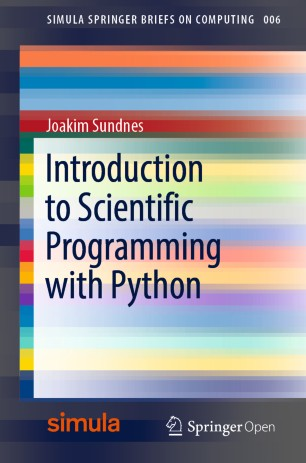

# Introduction to Scientific Programming with Python

This repository contains source code and Jupyter notebooks for the book ["Introduction to scientific programming with Python"](https://www.springer.com/gp/book/9783030503550), published as part of the Simula SpringerBriefs on Computing, 2020.

The book gives a brief introduction to Python programming for scientific and computational applications, and is based on ["A Primer on Scientific Programming with Python"](https://link.springer.com/book/10.1007/978-3-662-49887-3). It was written for the introductory programming course "IN1900 – Introduction to Programming with Scientific Applications" at the University of Oslo.

## Jupyter notebooks for all book chapters
All the chapters of the book are available as Jupyter notebooks:
* Click [here](./ipynb.zip) to download all the notebooks in a  single zip file.
* Or browse the individual chapter files [here](./ipynb/). The ipynb files will render
  nicely if you view them on github, but to run the embedded Python code and make full
  use of the notebook format you need to download the files and run them locally using jupyter-notebook.

## Source code for code examples
Most of the code examples are available for download as regular .py files:
* Click here to download all the code examples as a single zip-file
* Or browse the chapters and download individual .py-files here
